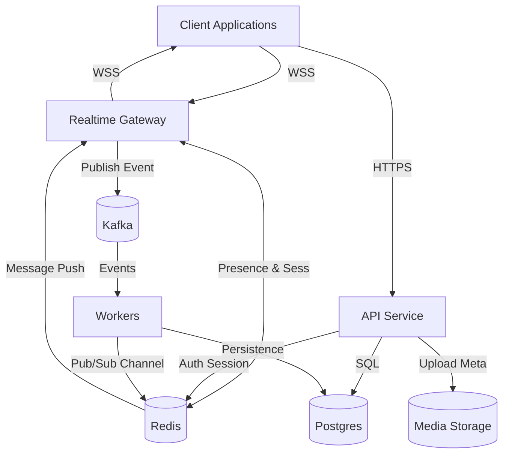

# SlickChat — Arquitetura de Deployment

## 1. Introdução

Este documento descreve a arquitetura de infraestrutura e deployment do sistema **SlickChat**.

O objetivo é definir como os componentes do sistema são executados em ambiente de execução, como se comunicam e quais tecnologias são utilizadas para garantir **escalabilidade, desempenho e resiliência**.

---

# 2. Visão Geral da Infraestrutura

A infraestrutura do SlickChat é composta pelos seguintes serviços principais:

```
Frontend Client
Realtime Gateway
API Service
Kafka (Event Streaming)
Redis (Cache / Presence / Rate Limit)
Workers
Postgres Database
Media Storage (MinIO / S3)
```

Arquitetura simplificada:

```
Clients
   ↓
Realtime Gateway (WebSocket)
   ↓
Kafka Event Stream
   ↓
Workers
   ↓
Postgres

Redis (auxiliar para presença, sessões e rate limiting)
```

---

# 3. Componentes da Infraestrutura

## Frontend Client

Aplicação web responsável pela interface com o usuário.

Responsabilidades:

* interface de chat
* comunicação via WebSocket
* chamadas HTTP para API

---

## Realtime Gateway

Serviço responsável por manter conexões WebSocket com clientes.

Responsabilidades:

* gerenciar conexões de usuários
* autenticar sessões
* atualizar presença de usuários
* receber eventos do cliente
* publicar eventos no Kafka
* distribuir mensagens recebidas

Este componente é **stateless** e pode escalar horizontalmente.

Informações temporárias (presença e sessões) são armazenadas em **Redis**.

---

## API Service

Serviço HTTP responsável por operações administrativas.

Exemplos:

* criação de contas
* autenticação
* criação de salas
* upload de arquivos
* moderação

Esse serviço também pode publicar eventos no Kafka quando necessário.

---

## Kafka — Event Streaming

Kafka é utilizado como **broker de eventos do sistema**.

Responsabilidades:

* transporte de eventos entre serviços
* desacoplamento entre componentes
* processamento assíncrono
* alta taxa de mensagens

Exemplos de eventos publicados:

```
MessageSent
UserJoinedRoom
RoomCreated
RoomExpired
UserMuted
UserBanned
ReportCreated
```

Kafka permite que múltiplos consumidores processem eventos de forma independente.

---

# 4. Por que utilizar Kafka

Kafka é utilizado para resolver problemas de **event streaming e comunicação entre serviços**.

Benefícios:

* alta capacidade de throughput
* persistência de eventos
* possibilidade de replay de eventos
* desacoplamento entre produtores e consumidores
* suporte a múltiplos consumidores

Isso permite que o sistema processe eventos como envio de mensagens, moderação e expiração de salas de forma **assíncrona e escalável**.

---

# 5. Redis — Cache e Dados Temporários

Redis é utilizado para armazenar **dados temporários e operações de baixa latência**.

Diferente do Kafka, Redis opera principalmente em memória, oferecendo acesso extremamente rápido.

Principais usos no SlickChat:

```
rate limiting
presença de usuários
sessões ativas
cache de dados
```

---

# 6. Por que utilizar Redis

Redis resolve problemas diferentes do Kafka.

Enquanto Kafka é usado para **eventos persistentes e processamento assíncrono**, Redis é usado para **dados temporários e acesso ultra rápido**.

Diferente de um rate limit em memória local, o uso do **Redis** garante um **Global Rate Limiting**. Mesmo que o usuário troque de instância de Gateway ou API via Load Balancer, o contador de mensagens e requisições permanece unificado, prevenindo ataques de flood distribuídos (DDoS).

Comparação:

| Tecnologia | Função Principal                            |
| ---------- | ------------------------------------------- |
| Kafka      | Event streaming e mensageria entre serviços |
| Redis      | Cache, presença e controle de requisições   |

Redis é ideal para:

* verificar rapidamente se um usuário está online
* controlar número de mensagens por segundo
* armazenar sessões temporárias

Essas operações precisam ocorrer em **milissegundos**, o que torna Redis uma escolha adequada.

---

# 7. Workers

Workers são responsáveis pelo processamento assíncrono de eventos consumidos do Kafka.

Tipos de workers:

### Fanout Worker

Distribui mensagens para gateways conectados.

### Persistence Worker

Armazena mensagens e eventos no banco de dados.

Esse worker ignora persistência quando a sala está em **Zero Logging Mode**.

### TTL Worker

Remove mensagens expiradas e salas temporárias.

### Moderation Worker

Processa eventos de moderação.

Workers podem ser escalados horizontalmente.

---

# 8. Postgres Database

Postgres é utilizado como banco de dados principal.

Dados persistidos incluem:

* usuários
* salas
* mensagens
* membros de salas
* denúncias
* ações de moderação

Mensagens com TTL podem ser removidas automaticamente por workers.

---

# 9. Media Storage

Arquivos anexados são armazenados em um sistema de armazenamento externo.

Será utilizado o sistema de armazenamento **MinIO**

O banco de dados armazena apenas **metadados e URLs de acesso**.

---

# 10. Diagrama de Infraestrutura



---

# 11. Arquitetura de Containers (Docker)

Ambiente de desenvolvimento pode ser executado com Docker Compose.

Serviços principais:

```
frontend
realtime-gateway
api-service
worker
kafka
redis
postgres
minio
```

Isso permite executar toda a arquitetura localmente para desenvolvimento e testes.

---

# 12. Escalabilidade

Componentes escaláveis:

```
realtime-gateway
workers
api-service
```

Kafka distribui eventos entre múltiplos consumidores.

Redis pode ser executado em cluster para suportar alto volume de operações.
