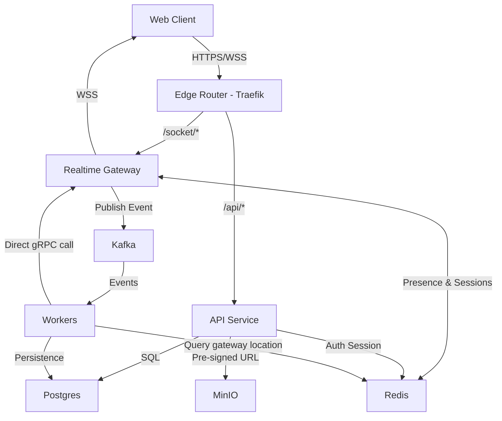

# SlickChat — Arquitetura de Deployment

## 1. Introdução

Este documento descreve a arquitetura de infraestrutura e deployment do sistema **SlickChat**, definindo como os componentes são executados, se comunicam e quais tecnologias garantem **escalabilidade, desempenho e resiliência**.

---

# 2. Visão Geral da Infraestrutura

A infraestrutura é composta pelos seguintes serviços:

```
Edge Router (Traefik)
Web Client
Realtime Gateway
API Service
Kafka (Event Streaming)
Redis (Cache / Presence / Rate Limit)
Workers
Postgres Database
Media Storage (MinIO)
```


---

# 3. Componentes da Infraestrutura

## Edge Router (Traefik)

Ponto de entrada único.
- Terminação TLS (HTTPS/WSS)
- Roteamento baseado em path
- Balanceamento de carga
- Certificados automáticos (Let's Encrypt)

## Frontend Client

Aplicação web (React) que se comunica via HTTPS (API) e WSS (Gateway).

## Realtime Gateway

Serviço Go que mantém conexões WebSocket.
- Stateless, escalável horizontalmente
- Autentica via Redis
- Publica eventos no Kafka
- Recebe mensagens via Redis Pub/Sub

## API Service

Serviço Go para operações HTTP.
- CRUD de usuários, salas, moderação
- Geração de pre‑signed URLs para upload
- Publica eventos no Kafka

## Kafka

Broker de eventos.
- Tópicos: `user-events`, `presence-events`, `room-events`, `message-events`, `moderation-events`
- Partição por `room_id` para ordenação

## Redis

Armazenamento em memória.
- Estruturas: hashes para presença, strings para rate limit, pub/sub para fanout
- Cluster opcional para alta disponibilidade

## Workers

Processadores assíncronos em Go.
- Fanout Worker: Distribui mensagens para gateways conectados. Para isso, consulta o Redis para identificar em qual gateway o destinatário está conectado e envia a mensagem diretamente para aquela instância.
- Persistence Worker: insere dados no Postgres (exceto zero logging)
- TTL Worker: varre e remove registros expirados
- Moderation Worker: aplica bans/mutes

## Postgres

Banco relacional principal.
- Tabelas conforme modelo de domínio
- Índices em `expires_at` para expiração eficiente

## MinIO

Armazenamento de objetos S3‑compatible.
- Buckets separados por tipo de mídia
- Pre‑signed URLs para upload seguro

---

# 4. Diagrama de Infraestrutura



# 5. Por que Kafka e Redis?

| Tecnologia        | Função Principal               | Motivo                     |
|--------------|--------------------|-------------------------------|
| Kafka      | Event streaming e mensageria entre serviços               | Persistência, replay, desacoplamento  |
| Redis     | Cache, presença, rate limit, pub/sub             | Latência ultrabaixa, operações atômicas    |

O uso combinado garante escalabilidade e baixa latência para os diferentes tipos de operação.


# 6. Arquitetura de Containers (Docker)
Ambiente de desenvolvimento com Docker Compose:

```yml
services:
  traefik:
    image: traefik:latest
  frontend:
    build: ./frontend
  realtime-gateway:
    build: ./gateway
  api-service:
    build: ./api
  worker:
    build: ./worker
  kafka:
    image: confluentinc/cp-kafka
  redis:
    image: redis:alpine
  postgres:
    image: postgres:15
  minio:
    image: minio/minio
```

# 7. Escalabilidade
Componentes escaláveis horizontalmente:

- Edge Router (múltiplas instâncias com balanceamento)

- Realtime Gateway

- Workers (por tipo)

- API Service

- Kafka distribui eventos entre consumidores. Redis pode ser clusterizado.

# 8. Resumo
A infraestrutura do SlickChat é projetada para:

- Alta disponibilidade

- Escalabilidade horizontal

- Baixa latência na entrega de mensagens

- Isolamento entre componentes via eventos

- Privacidade e segurança desde a base