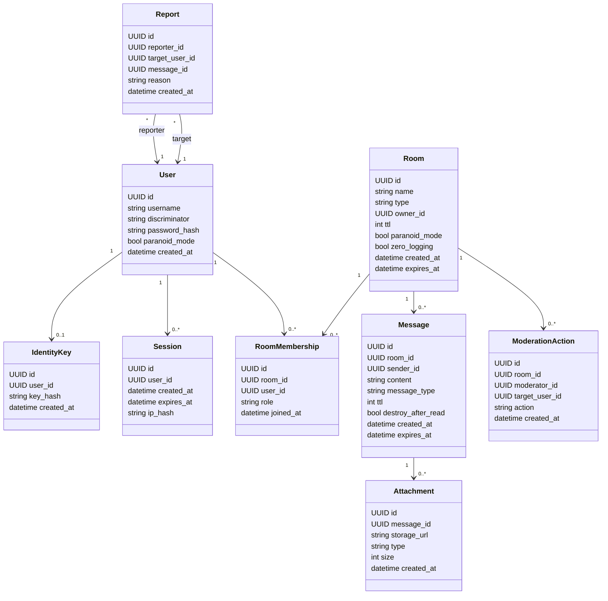
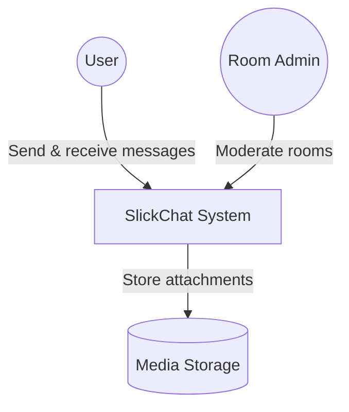
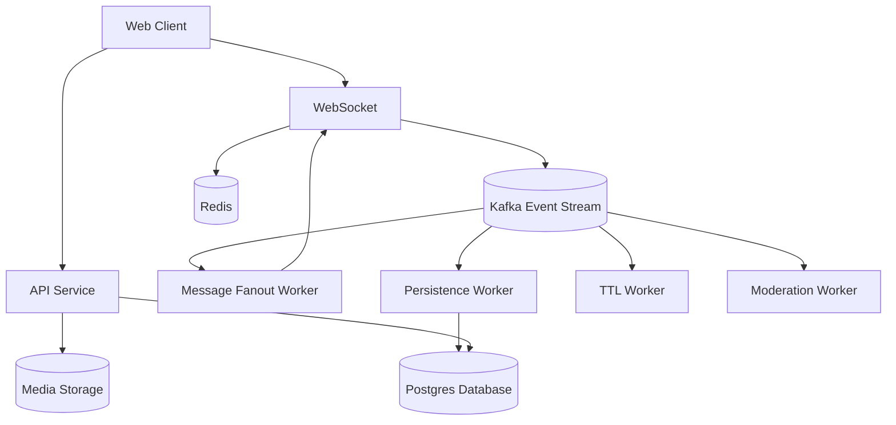
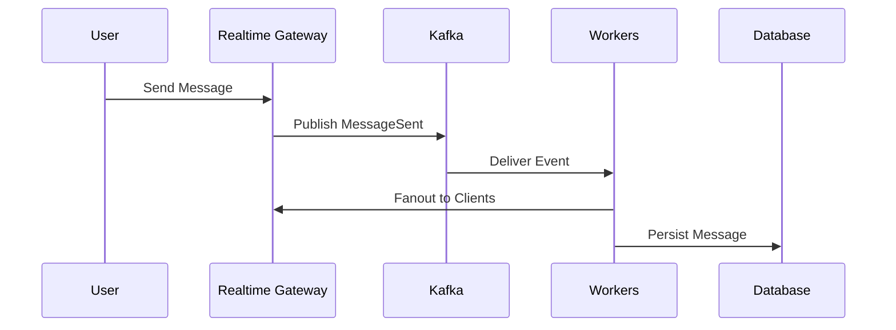
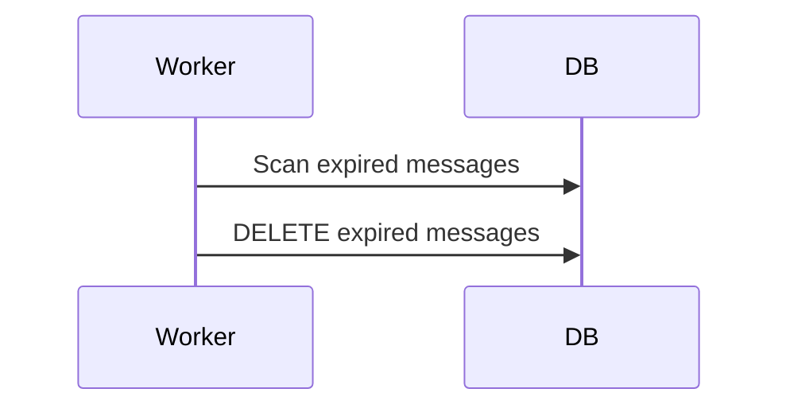

# SlickChat — Diagramas de Design

Este documento contém os principais diagramas de design do sistema **SlickChat** baseados no modelo de domínio definido em modelo_dominio.

Os diagramas são fornecidos em **Mermaid** para fácil visualização e também podem ser importados em diversas ferramentas.

---

# 1. Diagrama de Classes

---

# 2. C4 Model — System Context

Descrição:

* Usuários interagem com o sistema SlickChat
* Administradores de sala realizam moderação
* O sistema utiliza armazenamento para mídia e banco de dados para persistência

---

# 3. C4 Model — Container Diagram

Descrição:

* Clientes se conectam via **WebSocket Gateway** para comunicação em tempo real

* Eventos de chat são publicados em **Kafka**

* Workers consomem eventos para:

  * distribuir mensagens
  * persistir dados
  * aplicar TTL
  * executar moderação

* **Redis** é utilizado para presença, sessões e rate limiting

* Dados persistentes são armazenados em **Postgres**

* Arquivos e anexos são armazenados em **Media Storage**

---

# 4. Fluxo de Mensagem

---

# 5. Fluxo de Expiração de Mensagens

Mensagens com TTL são removidas fisicamente do banco de dados.
